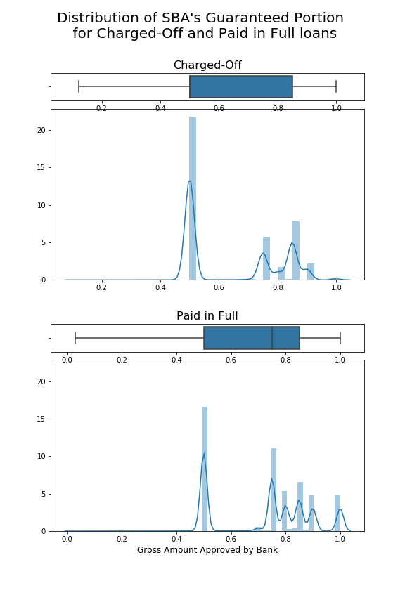

# Should This Loan be Approved or Denied?

The goal of this project is to build a model that will predict whether a loan should be approved or denied, based on a large dataset from the U.S Small Business Administration (SBA).

The U.S. SBA was founded in 1953 on the principle of promoting and assisting small enterprises in the U.S. credit market.
One way SBA assists these small business enterprises is through a **loan guarantee program** which is designed to encourage banks to grant loans to small businesses. 
SBA acts much like an insurance provider to reduce the risk for a bank by taking on some of the risk through guaranteeing a portion of the loan. **In the case that a loan goes into default, SBA then covers the amount they guaranteed**.

There have been many success stories of start-ups receiving SBA loan guarantees such as FedEx and Apple Computer.

## Data

This project is based on this [article](https://www.tandfonline.com/doi/full/10.1080/10691898.2018.1434342) and its dataset.

Here is the list of variables in this dataset :

| Variable name    |  Description of variable   |
| --- | --- |
| LoanNr_ChkDgt| Primary key |
| Name | Borrower name |
| City | Borrower city |
| State | Borrower state |
| Zip | Borrower zip code |
| Bank | Bank name |
| BankState | Bank state |
| NAICS | North American industry classification system code |
| ApprovalDate | Date SBA commitment issued |
| ApprovalFY | Fiscal year of commitment |
| Term | Loan term in months |
| NoEmp | Number of business employees |
| NewExist | 1 = Existing business / 2 = New business |
| CreateJob | Number of jobs created |
| RetainedJob | Number of jobs retained |
| FranchiseCode | Franchise code, (00000 or 00001) = No franchise |
| UrbanRural | 1 = Urban / 2 = rural / 0 = undefined |
| RevLineCr | Revolving line of credit: Y = Yes / N = No |
| LowDoc | LowDoc Loan Program: Y = Yes / N = No |
| ChgOffDate | The date when a loan is declared to be in default |
| DisbursementDate | Disbursement date |
| DisbursementGross | Amount disbursed |
| BalanceGross | Gross amount outstanding |
| MIS_Status | Loan status charged off = CHGOFF, Paid in full = PIF |
| ChgOffPrinGr | Charged-off amount |
| GrAppv | Gross amount of loan approved by bank |
| SBA_Appv | SBA’s guaranteed amount of approved loan |

### Time frame

The dataset includes historical data from 1962 through 2014.

### NewExist

This variable represents whether the business is an existing business (in existence for more than 2 years) or a new business (in existence for less than or equal to 2 years).

### NAICS (North American Industry Classification System)

This is a 2- through 6-digit hierarchical classification system used by Federal statistical agencies in classifying business establishments for the collection, analysis, and presentation of statistical data describing the U.S. economy. The first two digits of the NAICS classification **represent the economic sector** ([see table here](https://www.census.gov/cgi-bin/sssd/naics/naicsrch?chart=2012)).

### Loan status

All loans in the dataset have a known status:
- either they have been **paid in full** by the end of the term of the loan
- or they are **charged-off**: the borrower has defaulted on his loan.

## Additional information about SBA loans

From this [document](https://www.sba.gov/sites/default/files/SDOLoanFactSheet_Oct_2011.pdf):

- **Guarantee Portion** - Under the 7(a) guaranteed loan program SBA typically guarantees from 50% to 85% of an eligible bankloan up to a maximum guaranty amount of \\$3,750,000. The exact percentage of the guaranty depends on a variety of factors such as size of loan and which SBA program is to be used. This will be worked out between the SBA and your bank.
- **Amounts** - The maximum loan amount is \\$5 million. The total SBA guarantee for any one borrower may not exceed
\\$3,750,000. 
- **Maturity** - Up to 25 years for real estate acquisition or construction. Most other SBA loans are limited to 10 years. Working
capital loans are generally limited to seven years. 

## Feature Engineering and Feature Selection

### Target = Is the loan charged-off ?

In this project, we want to predict if the loan will be charged-off (So that we don't approve the loan).
The binary target feature **Is_CHGOFF** is created with a value 1 if the loan is charged-off, else 0.

**Missing value imputation and error handling**:

I filled the missing values and corrected possible errors in the dataset following these 2 assumptions:

1. if the charged-off amount (ChgOffPrinGr) is 0, then the status must be P I F 
2. if there is a chargeoff date, then status must be CHGOFF

### State

**Missing value imputation**

 I filled the missing values with information from the Zip code where there are no missing values (I used the mode of State for the subset with matching zip code)
 
We need this feature because states have different economic environments that can influence the default rate:

### Economic Sector

We extract the economic sector from the NAICS variable. The économic sector can be a usefull feature: in different sectors, the default rate are signicatively different:

### New Business

The fact that a business is new (less than 2 years) or is active for more than 2 years can influence the default rate:

The p-value of the T-test (two-sided test for the null hypothesis that the 2 independent samples - New Businesses and Existing Businesses -  have identical average (expected) Is_CHGOFF values (= default rate)) is $6.10^{-85}$: there is a statistically significant difference between the default rates of the 2 samples.

### Revolving line of credit

The fact that a business has a revolving line of credit or not varies significantly the default rate:

### Number of employees

Businnesses with no or a few employees are mostly new businesses that are more fragile. The distribution of the number of employees in the charged-off loans and for the paid in full loans is different: charged-off loans correspond to less employees in average.

### Jobs Created and Retained

The 2 variables CreateJob and RetainedJob are very highly correlated (0.99): almost 50% of the data have identical value in the 2 columns.
The default rate varies with whether: 
- jobs were retained, 
- jobs were created but no job was retained, 
- or no jobs were created or retained.

(When jobs are retained, there is no statistically significant difference between the 2 samples "No Job Created" and "Jobs Created" (T-test's p-value = 0.08))

So I created 1 column with these 3 categories.

### Real Estate Loans

Loans are limited to a 10 years term, except for the real estate and construction loans that are limited to a 25 years term.
I created a binary variable, “Is_RealEstate” where “Is_RealEstate” = 1 if “Term” > 120 months and “Is_RealEstate” = 0 if “Term” <120 months.
The default rate is much higher for loans with a term < 120 months than for the loans with a term > 120 months:

### Amount approved by the bank

The distribution of the Amount approved by the bank in the charged-off loans and for the paid in full loans is different: charged-off loans correspond to a smaller amount in average.

### SBA’s Guaranteed Portion of Approved Amount

The gross amount of the loan approved by the bank and the SBA's guaranteed amount are highly correlated.
I created a feature "SBA_portion" corresponding to the ratio between the SBA's guaranteed amount and the gross amount approved (SBA_Appv / GrAppv).

The median value of "SBA_portion" is much lower for charged-off loans (50%) than paid in full loans (75%).

### Recession

A recession has an impact on businesses and loans: loans are more likely to default during a recession.

I added a feature "Is_Recession_08" stating whether the loan has been going on during the Great Recession (dec 2007- june 2009): as we can't predict a recession a long time before it happens, I only took into account in this feature the **loans that started during the Great Recession**: it will help predict loans in future recession (2020 for example...) 

The default rate for loans starting during the Great Recession (34%) is much higher than for other loans (17%).

## Model selection
 
### Metrics

This is a binary classification problem. The goal is to detect the loans that will charge-off if approved, in order to denie them.

The bank will lose both principal and interest if a loan is misclassified as "will pay in full" and then is charged off, 
while the bank will only incur opportunity cost in the amount of interest if a loan is misclassified as "will charge-off".

So we want to prioritize minimizing the false negative rate: the metric we will use is the **recall**: 
$$ \frac{TP}{TP+FN} $$
where: 
- TP = number of True Positive
- FN = number of False Negative

## Tools

* Python
* NumPy
* SciPy
* Pandas
* Matplotlib
* Seaborn
* Scikit-Learn

## Future Improvements

to be continued...
